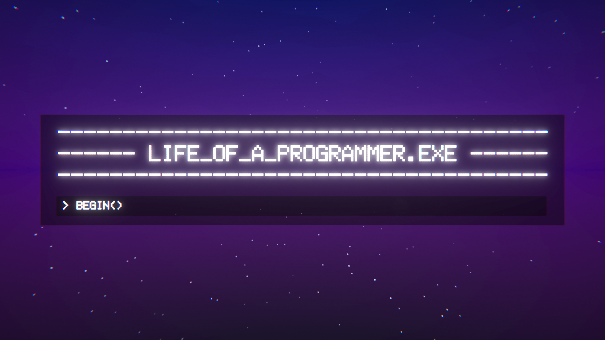
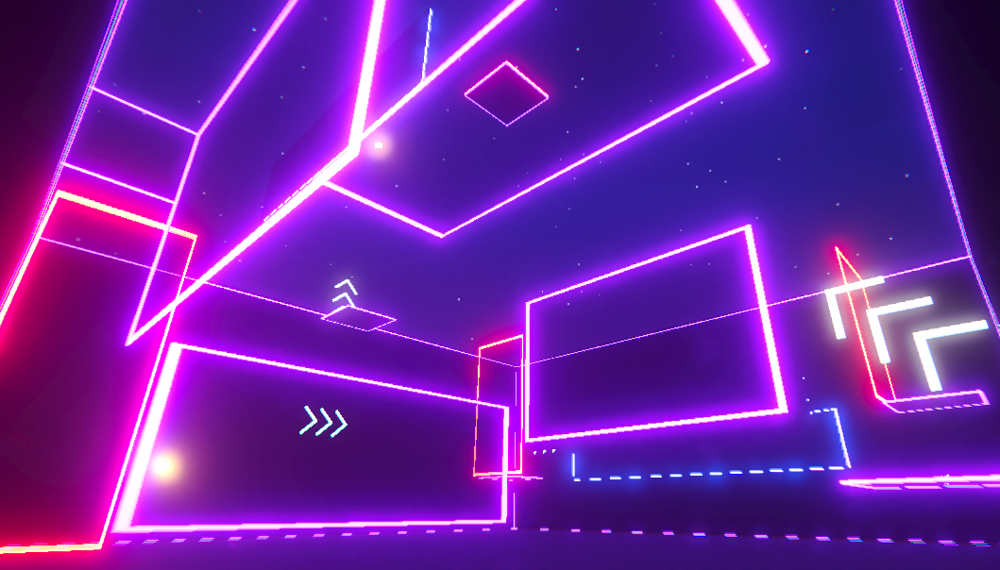
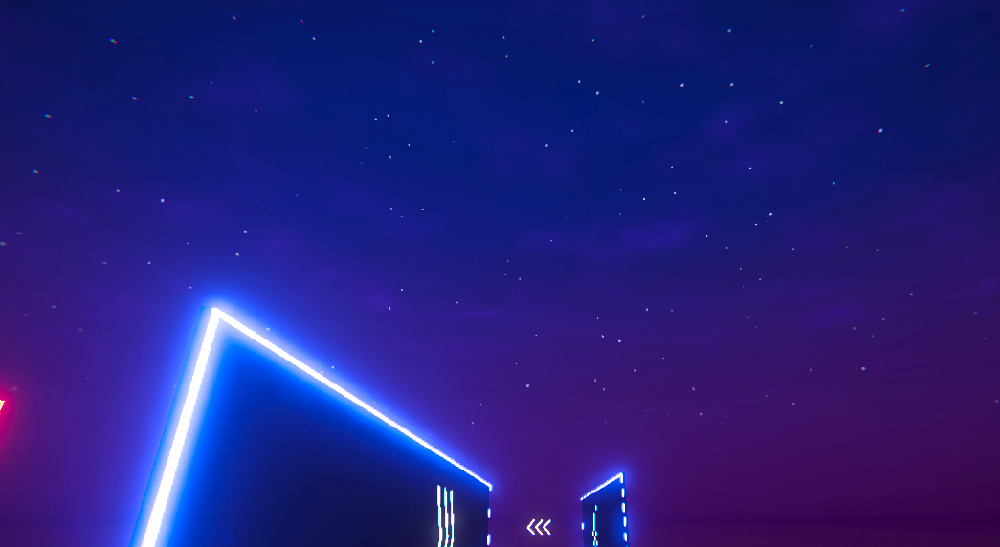

# Team 21 - Report

The original readme file can be found as `Docs/ORIGINAL_README.md`.

# COMP30019 - Team 21 Report

## Brief Game Explanation

life_of_a_programmer.exe is a game set as the imaginary hyperbolic stereotype of what it is like to be an everyday programmer. The story is that you are a programmer running through code trying to catch a bug at the very end of the level in the shortest time possible.

In accordance with the code running metaphor, the game has you parkour your way through obstacles over the course of several levels, each of which has a bug. In particular, you are able to double jump, dash, grapple, launch from boostpads and wall run to navigate.

Throughout each level you will see many references to common programming concepts. To name a few, each level is named after a common programming error (save for the tutorial), the tutorial controls are defined in array notation, the main menu is a terminal and of course, the end goal is to catch the bug.

## Getting Started

The first level is 0_hello_world.lvl and introduces each of the mechanics gradually.

On the bottom left of the Heads Up Display (HUD) you will see a dash meter where the two circles with triangles inside represent dashes currently able to be used (greyed out when unable) and the three arrows will fill up to recharge a used dash every one second. Also seen is a timer for the stopwatch that will begin counting up after passing through the first checkpoint and finish after reaching the final checkpoint (the bug).

## Aesthetics of Objects and Entities (how it was designed)

In order to keep the reliance on external assets to a minimum, as well as allow us to easily generate assets, only planes, cubes, a gun asset, icons and text were utilised in the game.

A neon aesthetic was utilised to give the main visual flair of the game. This was achieved by making liberal use of the emissive property of materials to create the neon lights that distinguish the various elements of the game. The use of the bloom effect in the Universal Render Pipeline (URP) was extensively used to achieve the neon light effect from the emissive materials.

As stated this allows for easily distinguishable gameplay elements. For example, only the grapple points are emissive orange, boost pads are emissive aqua, and the final bug is an emissive golden yellow to signal the final destination.

## The Graphics Pipeline and Camera Motion

The Graphics Pipeline remained relatively untouched save for the procedurally generated clouds, fog shader, distortion shader and the use of the URP in build post processing. The clouds and shaders will be discussed below.

As previously mentioned, the URP is utilised extensively to allow the use of various post processing effects. This gave us the ability to add a great amount of visual polish that would otherwise result in a very bland looking aesthetic. The most notable effects would be the chromatic aberration, bloom, color adjustments and depth of field. The chromatic aberration is used to give a distorted look to the edges of the screen to give off a sense of speed. Bloom is discussed previously and used extensively. Slight color adjustments are used to give a more cohesive colour palette. Depth of field is mostly notable when wallrunning and having the gun blur.

## Procedurally Generated Clouds

The procedurally generated element is the subtle clouds that appear over every level to break up the clear starry sky.

This effect was created in Shader Graph and applied to a plane. A Tiling and Offset node was used to adjust the UV of a simple noise. This is constantly being updated with a Time node to animate it over time. A Power node is used to increase/decrease the density of the brightest parts of the simple noise, which equate to cloud density. We then multiply output of the adjusted simple noise with a colour value to change the colour of the clouds. Finally, we output the simple noise to the alpha channel of the fragment shader alpha channel such that the darkest parts of the noise are transparent.

## Shaders

### Boost Pad Distortion

### Fog

## Particle System

There are two places where particles are used, the bounce pads and the final bug. We will elaborate on the boost pad as this is what we wish to be marked.

The particles are placed such that they appear to emit from the boost pad. They emit with a fast upward velocity, from any part of the boost pad surface. They then shrink over their lifespan before eventually being destroyed. There is also some randomness introduced for variation. This fast upwards emission also serves as an indication to the user of the functionality of the boost pad.

The particles themselves share the same emissive material as the boost pad for visual consistency. Also as a result of using a material with no texture or shape, each particle is square shaped which is in line with the rest of the game’s blocky aesthetic.

The in-built Unity particle system was used to create this particle effect.

## The Querying and Observational Methods Used

The notes created on the observations can be found at `Docs/Playtesting.pdf`.

### Query

The query technique employed was the Interview technique. What this entailed was that each participant was to play the game as much as they liked, on any of the four available levels (of course starting from the tutorial), then afterwards a series of questions was asked conversationally. The answers of which were recorded into a Google Doc. If at any point there is confusion we would assist if it is clear that they cannot progress without intervention.

We had five participants take part in the query evaluation technique. All of which were in the 20 - 23 age range and were all to some degree regular gamers. Only one of which (Cynthia) had not played first person games before.

The questions asked and general feedback were as follows:
1: Do you think with the current controls, you’re able to further improve your time to be faster?
As the game is a parkour racing game, we wanted to have the player play each level multiple times to try and improve their time each time. The possibility for optimisation and shortcuts are intentionally left in to be discovered.

The general response from the playetesters was that, given more time, they would be able to reduce their times.

2: How intuitive are the controls?

The game utilises the standard first person shooter control layout, and thus should be very easy to grasp. This is more intended for if the double jump and double dash mechanics feel intuitive.

The response was unanimously in favour of the controls and how intuitive they are.

3: What is the least intuitive mechanic?

This pertains to each of the featured mechanics of the game. These being the wallrunning, grappling, dashing, double jumping and the boostpads.

It was almost unanimously the wallrunning that was the least intuitive mechanic. We noticed that participants would aim in the direction that they wished to jump, however their momentum would carry them in their current direction. Further, it was not obvious to participants that the ‘A’ or ‘D’ keys would need to be held down during a wallrun.

4: What do you think about the difficulty of the game?

A good game difficulty would have a linear progression of difficulty over the course of many levels.

Given the context of skill levels of each other participants, the game seemed to be challenging, but not to the point of not being fun. More experienced participants would be able to pick up the controls and complete levels easily while less experienced participants would require many more attempts to complete a level. This is not bad however, overall the difficulty was acknowledged to be slightly above average but not to a frustrating degree.

5: What do you think you would add to the game to improve it?

This was to be an open hypothetical question for any features or improvements that the participants wanted. Obviously, not all requests were able to be met with how out of scope some of them tended to be.

Cynthia and Amy had requested that abilities were to be unlocked throughout the game. While this is a good idea, in terms of a story based game with a progression, the game is designed as a discrete set of levels with no connection to each other.

Houston and Louis had both requested momentum, this is a very good idea that was in the works for some time. However, it was not able to be implemented in time for the final due date.

Romy had requested hidden alternate routes that would act as shortcuts for the more skillful players. With two more levels to be built, this may very well be possible.

### Observational

## Changes Made

## Contributions Made - Ryan

Eight of the ten participants for the evaluation were arranged by me.
Post processing effects, including the use of bloom on many of the assets.
Opening screen, and level selection screen.
Scene fade transitions, as well as scripting the ability to switch levels.
Pause menu, including the sensitivity and music sliders.
Double jumping.
Boost pads.
Dash ability.
Coming up with the story, cinematics, and editing the gameplay video.
All sound design of the various elements. Including the synthesis of some original sounds.
Music choice and playback during gameplay and the level select screen.

## Contributions Made - Marvin

## Contributions Made - Seth

## References

Prevention of weapon clipping: https://www.linkedin.com/pulse/how-prevent-weapon-clipping-unity-urp-without-/

Clouds Shader: https://www.youtube.com/watch?v=xxhvUyvIH6s
